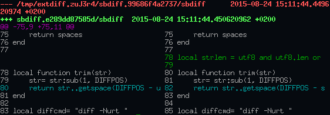

# sbdiff

sbdiff is a frontend for (GNU) `diff`.

It compares files and directories line by line, outputs the files side-by-side in two columns and colorizes the differences.
Because it is a console application, no GUI is necessary.

The code is available at:

* [https://bitbucket.org/becki/sbdiff](https://bitbucket.org/becki/sbdiff) (primary)
* [https://github.com/becki/sbdiff](https://github.com/becki/sbdiff) (mirror)

## Install

In order to use it, you need [Lua](http://lua.org/) 5.2 or newer and the `diff` command in your `PATH`. 

Then just copy the file `sbdiff` e.g. to `/usr/local/bin/`.

## Standalone Usage

Type `sbdiff foo bar` to see the differences between file foo and file bar or directory foo and directory bar.

## Integration with Mercurial

* Per user: Append the file `sbdiffhg.rc` to your `$HOME/.hgrc`
* Or for all users: Copy `sbdiffhg.rc` into `/etc/mercurial/hgrc.d/`

Then you can use sbdiff within Mercurial as external diff command:

    hg sbdiff ...

## Integration with Git

Run the following commands: (This will change `$HOME/.gitconfig`)

    git config --global diff.tool sbdiff
    git config --global difftool.sbdiff.cmd 'sbdiff $LOCAL $REMOTE'
    git config --global difftool.prompt false

Then you can use sbdiff within Git as external diff command:

    git difftool ...
